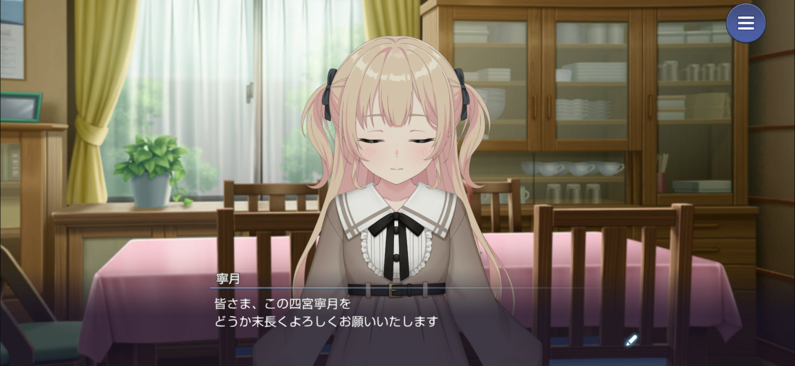
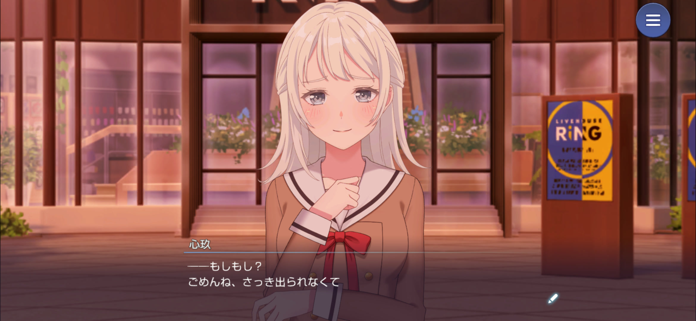
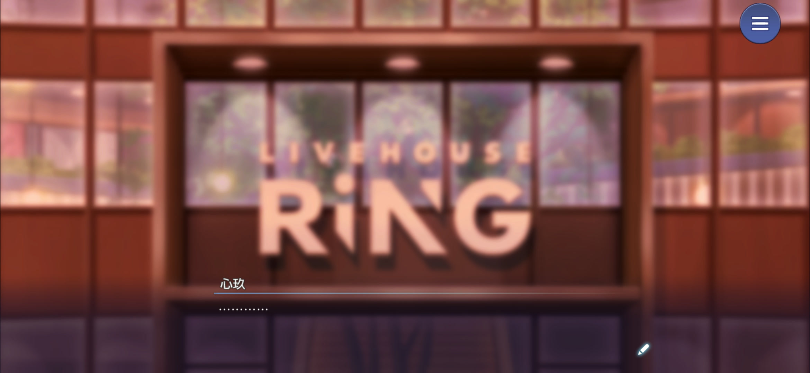
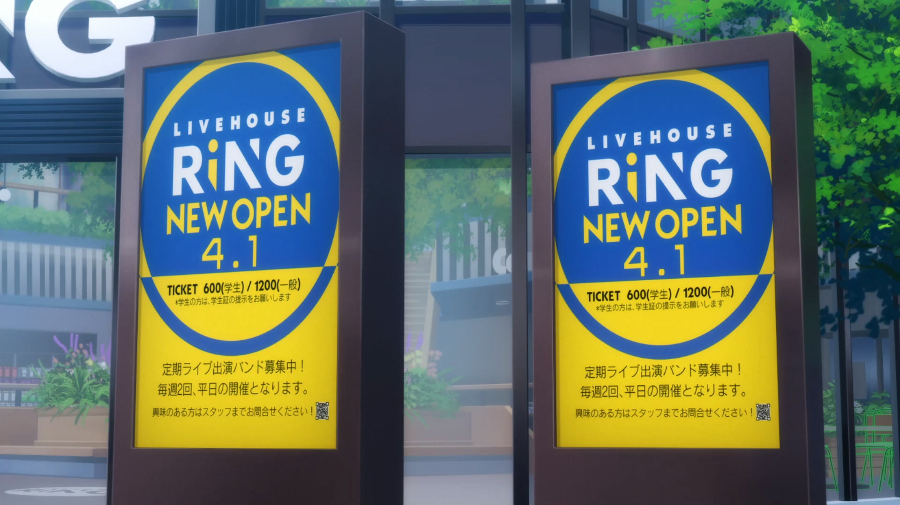
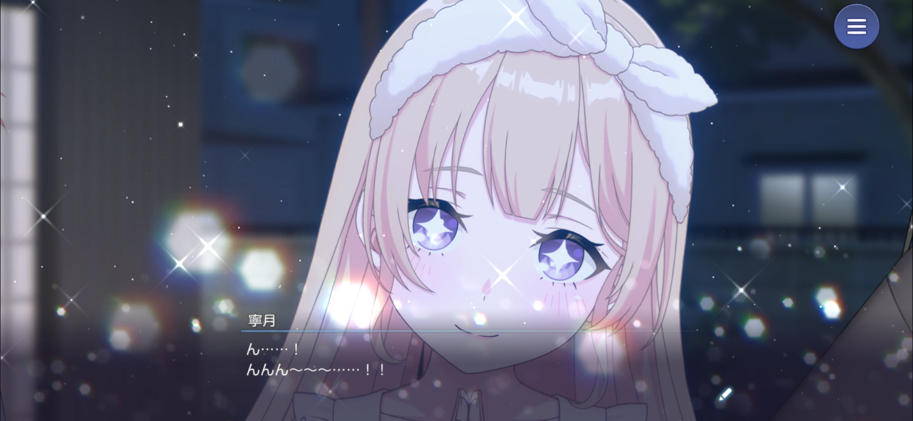
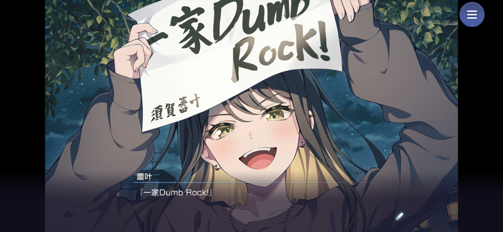

::: label
THOUGHTS ON THE STORY
:::

# 「THAT KIND 愛」感想

アワーノーツ 一家Dumb Rock! バンドストーリー「THAT KIND 愛」の感想です。
**※ネタバレ注意**

:::note
Xにつぶやくような内容をネタバレ防止のためにこっちに書いてるだけなので、ちゃんとした感想は期待しないでください。
:::

## 第1話

> ちえり「今日のちえりはすごいんですよ！　掃除もご飯も済ませて、お風呂まで沸かしたんです！」

ほんとか？
焦げた料理が出てくるパターンじゃ？

と思ったけど、アナザーストーリーまで読み終えると、ちえりはちゃんと家事のスペック高くて意外だった
ちえりの家庭環境も色々ありそうなので掘り下げが楽しみ
スペックが高い兄姉にコンプレックスを抱いてて、親から褒められることがなかったから褒められることに執着してる…とかそういう感じなのかな
でも、ちえりは褒められたいだけじゃなくてちゃんと他人を褒めることができるからいい奴なんだ

> 蕾叶「この家に来てくれた瞬間から、2人は私の大切なファミリーだよ！」

> 蕾叶「毎日同じ家で寝て、一緒にご飯を食べて、バンドをする。それがファミリーってもんでしょ！」

いや家族観ぶっ飛び過ぎてて草
でも最初は ばあちゃん受け売りのファミリー論を押し付けてただけだった蕾叶が、「ファミリーになりたい」と、自分たちなりのファミリーの形を見つけていくのがいいんだよなぁ

蕾叶以外も最初は全員「ファミリー？なにそれ？何でバンドやるん？」みたいな感じだったのに、ピンチを一緒に乗り越えるにつれて自然とファミリーになってくのが良かった

## 第2話

> 代理「寮とここの管理人代理の菅野代理（かんのより）です〜。代理って呼んで」

名前そのまんますぎぃ！

ちえりと蓬咲はしれっとドラムとベース演奏してるけど、もともと経験者だったのだろうか？
1話の態度からして、ピースミカに来てから始めたわけじゃなさそうだし
こんなに楽器経験者が集まるのも奇跡的よね（契約書に書いてあったとはいえ）

## 第3話

このストーリーは終始心玖視点で進んで行くのが面白い

> 心玖（あたし、鍵取りに来ただけだよね。珍獣たちのお遊戯会を観に来たわけじゃないよね）

心玖のモノローグ全体的に口悪くて草
まぁ母親の顔色伺って外面良く振る舞ってた反動なんだろうけど…

> 心玖（嘘……嘘でしょ……こんなの、聞いてない）

> 心玖（一軒家で、共同生活……　よりにもよってこの珍獣たちと……）

うーん、内見って大事

## 第6話

家団は皆家庭環境に難がありそうだけど、寧月んちがダントツでイカれてるだろｗ
中2の子を家から追い出して知らない地に倒れるまで放置とかネグレクトどころの話じゃないぞ
母親がどんなやつなのか見てみたいわ

ただ姉ちゃんはどうなんだろ

> 『寧月はもっと広い世界で生きられるよ。私のようにはならないで』

母親がやべーやつで、寧月が四宮家に束縛されないように外の世界に逃がした…のかな

それはそれとして…
寧月かわいいッッッ
お人形さんみたいでかわいい…！

## 第7話

ああっ！お嬢様式のおじぎ…
かわいい…ッ！

蕾叶の父親は音楽会社の社長か…
でも娘に興味はなく放任と
母親の話は一度も出てこなかったと思うけど、どうしたんだろう
ばあちゃんが母方ということはばあちゃんの娘のはずだけども

## 第9話

初めてのケンカがライブで、ってのがいい！
心玖は感情を音楽で表現するタイプだし、なんだかんだ相性いいんだろうな～

> 蕾叶「私、やっぱりみんなとファミリーになりたい！！」

そして心玖の演奏を聴いてファミリーを押し付けるだけじゃダメだと分かって、「ファミリーになりたい」に変化するのが蕾叶の成長を感じられていいね

## 第13話

> 寧月「それでも心玖は毎回、原曲の世界観を汲んで外れすぎないよう工夫をしている」

やっぱり寧月って表情に出さないだけで、人並み、もしくはそれ以上に感受性は豊かなんだよなー
これが、最後心玖が「なんとなく」寧月に曲を託す要因になったんだろうな

> 蕾叶「ほら、今のも！　耳触った！」

新品の弦のくだりといい、蕾叶もよく見てる

いや心玖さんめっちゃ楽しそうに作曲しますやん…
[ピースフル・ピーシーズ！](https://youtu.be/v8iMgOM5Lnc) 聴いても、Bメロで各パートのソロ入れたり、みんなのこと考えて曲作ってるのがよく分かる
やっぱストーリーと曲が連動するのって最高だ

## 第14話

いやーここ一番話したかった！

なんで心玖がRiNGの前にいるの！？
蕾叶の父親の会社とRiNGが関係あるってこと！？
最後あからさまにRiNGにパンしてるし！！

てかRiNGって楽奈ちゃんが中3になった年の4月1日にオープンしてるわけだよね？

> 出典：劇場版「BanG Dream! It's MyGO!!!!! 前編：春の陽だまり、迷い猫」（©BanG Dream! Project）より引用

ってことはRiNGが存在してる時点で少なくともMyGO!!!!!時空以降の話ってことじゃん！！
しかも [事前登録開始記念特番](https://youtu.be/oQhzSsp9Ppo?t=4269) で時間軸が違うって明言されてるから、MyGO!!!!!よりも未来の話…ってコト！？
それとも時間軸ってのはあくまで季節的な話？
それによってちえりが燈、愛音と同じクラスかどうか決まってくるから超重要なんですけどおおおおおおお

まさか、RiNGも蕾叶の父親の会社に買収されちゃったとか無いよね…？
そんで、第2章ではRiNGとNestを取り返すためにMyGO!!!!!と一家Dumb Rock!が手を組むとか…！？
流石に妄想が過ぎるか笑

なんか平成チックな演出が多かったから勝手に過去の話かと思い込んでたけど、これで過去の線はなさそうだなー
いやーこれはかなり衝撃だった

> ちえり「蕾叶だけに下げさせたりしませんよ！」

> 寧月「私からも……この通りだ」

> 蓬咲「私の安〜い頭なら何度でも下げますので、どうか……！！」

> 心玖「鈴木さん……私からも、お願いします」

痛みも苦しみも分かち合う、最高のファミリーや！
これ見てなお約束を反故にしようとする鈴木は人の心無いんか？

## 第15話

か…かわわわわぁ…
寧月の部屋着かわいすぎる…
もふもふカチューシャ…あああああああ

バンド名決定！
Dumb＝バカなって意味らしいけどそれでいいのか蕾叶ｗ

心玖…
自分を犠牲にしてまで「ホーム」を守った上、自分に未練が残らないようにあんなこと言ったんだよね
意外と不器用だなぁ…

あんな曲渡して居なくなったら心玖のこと素直に諦めてくれるわけないのに、それが分からないのは、心玖の周りにそこまで心玖のことを想ってくれる人がいなかったからなんだろうな

## 第16話

> 寧月「……凍らせたお米、チンするか？」

順当に庶民言葉に染まって来てますねプリンセス

うーん、寧月がパソコン使えるようになってるのアツい
蓬咲に、ファミリーに教わったことちゃんと生きてるよ

## 第17話

> 蓬咲「わかったことと言えば、もうすぐ心玖さんは社内向けのライブをすることくらいで……」

> 蓬咲「ええっと、確か……社長も観にくるライブで〜……　うまく行けば、デビューが決まって〜……」

いやそれが分かっただけでも凄すぎるわｗ
よく頑張った

## 第18話

> 蕾叶「私は、私のファミリー全員の幸せを選びたいんだ……！！」

自分を犠牲にしてでもファミリーのホームを守ろうとした心玖
大切なホームを手放してでも心玖を取り返そうとする蕾叶とファミリー…
相思相愛すぎて泣く

## 第19話

> 心玖「あたしをあの家に、連れて帰って……！！」

言えたじゃねぇか…😭

あああああここで「チェリ」「寧月」呼びになるの良いいいいい

> 心玖（あたしが帰りたいと思える、唯一の場所）

> 心玖（……ただいま……！）

😭😭😭

## 第20話

一家Dumb Rock!の一家団欒なパートいいですわぁ

> 心玖「……ファミリーのせいで、誰かの大切なものを諦めることはしない、とか……」

いい家訓だぁ…
ホームを守るために自分を捨てて
心玖を取り返すためにホームを捨てて
今度は心玖がホームを取り返そうとするなんて…
でっかい愛の渡しあいだ…

## 最後に

いやーいいストーリーだった
家族愛っていいよね

でも本来この家族愛って、本当の家族があげなきゃいけないものなんだよな
今後各家庭が抱えている問題は解決されていくのか…
この辺はまだまだ掘り下げられそうなので、今後が楽しみ

あとすごく気になったのは、現時点でツインボーカルなのか？ってこと
多分なんの描写も無いから、ストーリー上ではまだ蕾叶のソロボーカルってことだよね？
バンドリ初のツインボーカル、どういう経緯でそうなったのか気になりすぎるので、そこは是非今後掘り下げてほしい

また、事前情報どおりではあるけど、既存バンドはおろかmillsageとの絡みも全く無かったなー
ゆめみたではKiLLKiSS弾いてたりしてたけど、そういうのも一切無し

ただやっぱりRiNGの匂わせが気になりすぎる…
今後交わっていく可能性がなきにしもあらずなのではないか

ってことで、とりあえずmillsageと家団のストーリーを読み終えましたが、順当に両バンド共好きになりました😀
1st LIVE & GIG当たってくれえええええ
絶対倍率ヤバいけど…
